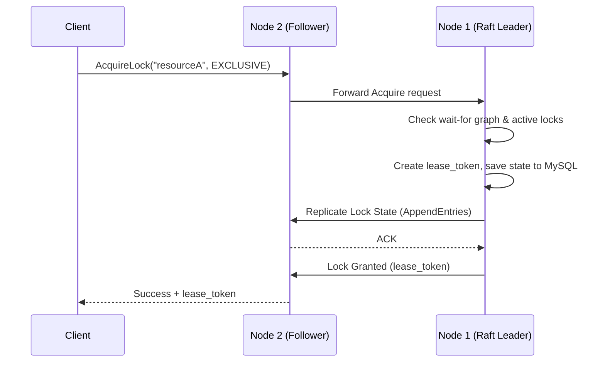
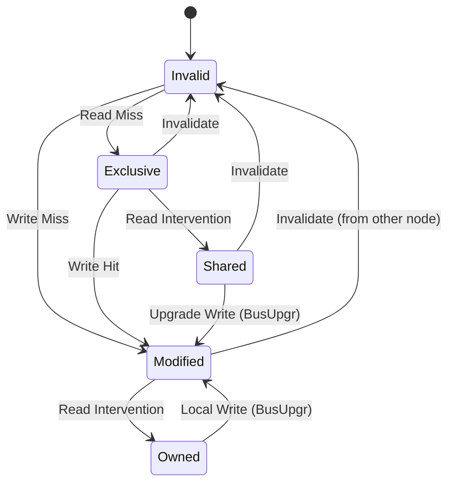

# Distributed Synchronization System — Architecture

## Overview

Sistem implementasi untuk Sinkronisasi Terdistribusi ini dibangun menggunakan **Python (asyncio)**, **gRPC** (komunikasi node), **MySQL & Redis** (persistence), dan **Kafka** (event streaming). Sistem dirancang agar dapat diskalakan (*highly scalable*) dan toleran terhadap kegagalan jaringan atau node.

Proyek ini mencakup komponen-komponen wajib dan opsional:
1. **Core Features**: Distributed Lock Manager, Queue System, Cache Coherence (MOESI), Containerization.
2. **Bonus Features**: PBFT (Consensus), Geo-Distributed System (LWW Eventual Consistency), ML Load Balancer (scikit-learn RandomForest), Security (RBAC + mTLS + Kafka Audit).

## 1. High-Level Architecture Diagram

```mermaid
graph TD
    classDef client fill:#3498db,stroke:#2980b9,color:white;
    classDef gateway fill:#9b59b6,stroke:#8e44ad,color:white;
    classDef node fill:#2ecc71,stroke:#27ae60,color:white;
    classDef db fill:#f39c12,stroke:#d35400,color:white;
    classDef infra fill:#e67e22,stroke:#d35400,color:white;

    Client1[Client Applications]:::client
    API_Gateway[API Gateway / FastAPI]:::gateway

    Client1 -->|REST API| API_Gateway
    
    subgraph US_Region [US Region (Core Cluster)]
        Node1[Node 1 : Lock, Cache, PBFT]:::node
        Node2[Node 2 : Queue, ML, PBFT]:::node
        Node3[Node 3 : Base, PBFT]:::node
    end
    
    subgraph Geo_Regions [Geo Replicas]
        NodeEU[Geo Node EU]:::node
        NodeAsia[Geo Node ASIA]:::node
    end

    API_Gateway -->|gRPC| Node1
    API_Gateway -->|gRPC| Node2
    API_Gateway -->|gRPC| NodeEU

    Node1 <-->|gRPC (mTLS, Raft, PBFT)| Node2
    Node2 <-->|gRPC| Node3
    Node1 <-->|gRPC| Node3

    Node1 -.-o|Async Cross-Region| NodeEU
    Node1 -.-o|Async Cross-Region| NodeAsia

    subgraph Data & Infrastructure
        MySQL[(MySQL : Logs, Locks, Users)]:::db
        Redis[(Redis : Cache Data)]:::db
        Kafka[[Kafka : Queues, Audit, DLQ]]:::infra
        Prometheus[Prometheus + Grafana]:::infra
    end

    Node1 --> MySQL
    Node2 --> Redis
    Node3 --> Kafka
    NodeEU --> Kafka
    
    Prometheus -.->|Scrape /metrics| Node1
    Prometheus -.->|Scrape /metrics| Node2
```

## 2. Distributed Lock Manager (Raft)

Manajer penguncian (*Lock Manager*) menggunakan **Raft Consensus Protocol** untuk menjaga kondisi kunci global (shared read / exclusive write) ke semua node. 

- **State Machine**: Kunci direpresentasikan dalam log. Acquire / Release dienkapsulasi sebagai sebuah *log entry*.
- **Deadlock Detection**: Node mendeteksi siklus pada **Wait-For Graph** secara berkala (DFS cycle detection). Jika terdeteksi *deadlock*, transaksi klien termuda akan di-*abort*.
- **Leases**: Kunci memiliki batas aktu (TTL). Node wajib memperbarui (*renew*) secara berkala.



## 3. Distributed Queue (Kafka + Consistent Hashing)

Sistem antrean dibangun di atas Kafka. **Consistent Hashing** digunakan untuk membagi beban pengelolaan partisi antrean terhadap setiap Node.

- **At-Least-Once Delivery**: Consumer (Node) mengambil pesan dan tidak memberikan ACK (*commit offset*) sebelum pekerjaan benar-benar selesai.
- **Failover**: Jika node pengelola partisi jatuh (mati), *Ring Hashing* akan merealokasi (rebalance) kunci partisi partisi tersebut ke node aktif berikutnya secara adil.
- **Dead Letter Queue (DLQ)**: Jika konsumen mengalami gagal pengerjaan pesan hingga melebih Max Retries (3x), pesan dibuang ke DLQ.

## 4. Cache Coherence (MOESI Protocol)

Cache nodes mempertahankan koherensi sistem multi-komputer menggunakan skema MOESI:
- **Modified (M)**: Menyimpan varian terbaru; data kotor (*dirty*); satu-satunya valid.
- **Owned (O)**: Mirip M, tetapi disebarkan ke beberapa *Shared* untuk bacaan performa tinggi (Intervention protocol).
- **Exclusive (E)**: Node satu-satunya pemilik logis, belum kotor.
- **Shared (S)**: Node lain juga memegang data yang sama.
- **Invalid (I)**: Berisi data kedaluwarsa oleh Write / Invalidate broadcast tipe jaringan.



## 5. Bonus Implementations

### C. ML-Based Load Balancer
Setiap Node dilengkapi ML model berdasarkan **RandomForestClassifier** yang memprediksi dan memetakan *latency*, *queue depth*, *CPU usage* untuk meneruskan beban (routing request) kepada Node yang dinilai paling memadai di detik tersebut. Terdapat pelacakan **IsolationForest** untuk anomali latensi seketika.

### B. Geo-Distributed Scaling
Guna menangani permintaan wilayah berbeda (`us`, `eu`, `asia`):
- Panggilan ditangani di pangkalan terdekat *(latency-aware routing)*.
- Operasi ditulis (*write*) secara asinkron menyebrangi benua menggunakan **Vector Clock** untuk menjaga Eventual Consistency. Konfilik diselesaikan dengan *Last-Writer-Wins* (LWW).

---
*Generated Documentation - Sister Tugas 3 - Distributed Sync System*
